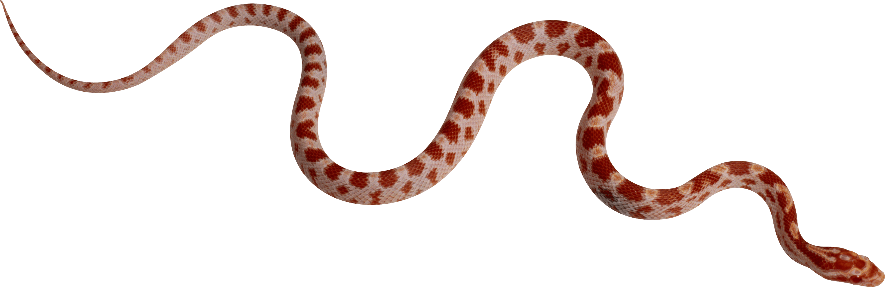

## Object Detection api

Para este proyecto estamos usando una api basada en tensorflow para la deteccion de objetos en [object-detection-api](https://github.com/tensorflow/models/tree/master/research/object_detection) el cual viene acompañado de unos tutoriales
de instalacion y uso.

### Tutorial

siguiendo los pasos de instalación con una variación al instalarlo en windows podemos llegar a obtener los siguientes
resultados: 


Aqui vamos a incluir los pasos que yo hice para instalarlo en windows.......(Proximamente)


### Generando Imagenes

Dado el poco conociemiento para generar imagenes con calidad, lo que hice a continuacion fue descargar unas imagenes ".png" de mis
objetos a reconocer y unos paisajes ".jpg" en donde pondremos nuestros objetos.

Estas son una de las imagenes descargadas:




```markdown

from PIL import Image
import numpy as np

for i in range(1,5):
""" Abriendo las imagenes entorno en donde pondremos nuestros objetos """
    habitat = "viboras/h" + str(i) + ".jpg"
    image = Image.open(habitat)#.convert("RGBA")
    
    for j in range(1,6):
    """ Abriendo nuestros objetos """
        vibora = "viboras/vib" + str(j) + ".png"
        vib = Image.open(vibora).convert("RGBA")
  
        for k in range(10):
        """ generamos un tamaño aleatorio entre 50 y 130 (se veian bien entre esos tamaños) y mantenemos la relacion de aspecto """
            size = np.random.randint(50,130)
            r = size/float(vib.width)
            sizeheight = int(vib.height * r)
            #vib = vib.rotate(np.random.randint(180))
            vib = vib.resize((size,sizeheight),Image.ANTIALIAS)
            image_copy = image.copy()
        """ generamos la posición de nuestro objeto(con el nuevo tamaño) sin que se pase de las dimensiones """   
            posw = np.random.randint((image_copy.width - vib.width))
            posh = np.random.randint((image_copy.height - vib.height))
            position = (posw, posh)
        """ pegamos en nuestro objeto en nuestra imagen entorno y la guardamos """
            image_copy.paste(vib, position,vib)
            new_name = "viboras_" + str(i) + "_" + str(j) +"_"+ str(k)+ ".jpg"
            image_copy.save(new_name)
            
```

Y estos son algunos de los resultados obtenidos al correr el codigo...no muy buenos pero creo que pueden funcionar

### Support or Contact

Having trouble with Pages? Check out our [documentation](https://help.github.com/categories/github-pages-basics/) or [contact support](https://github.com/contact) and we’ll help you sort it out.
