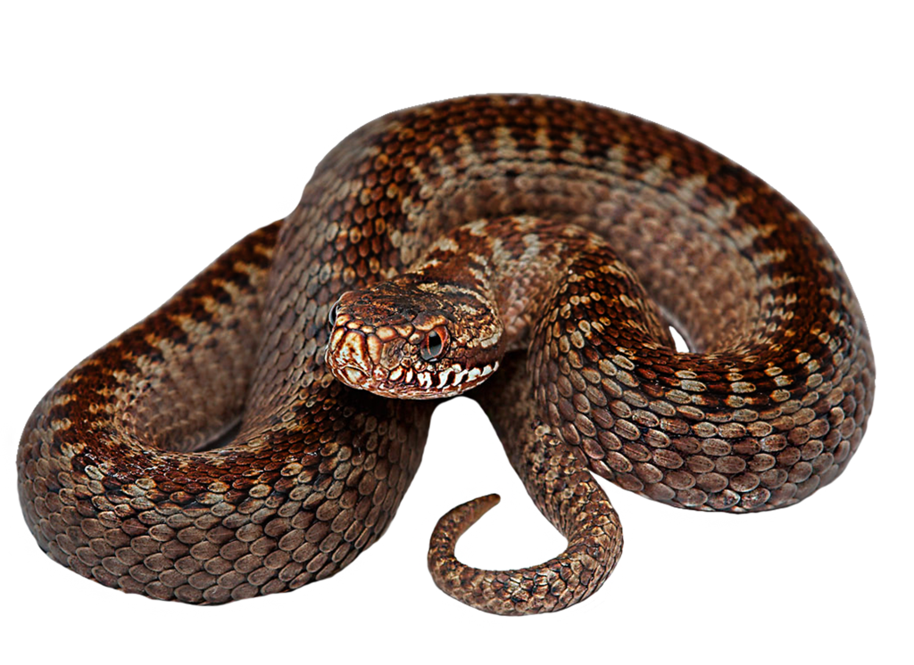
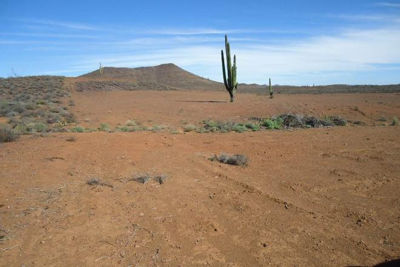
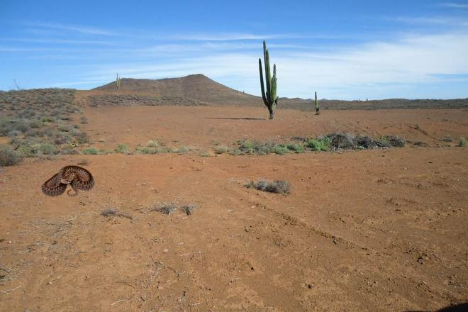
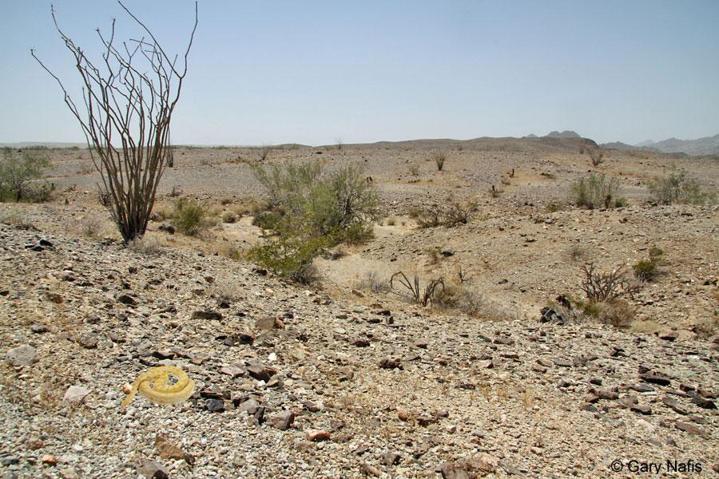

## Object Detection api

Para este proyecto estamos usando una api basada en tensorflow para la deteccion de objetos en [object-detection-api](https://github.com/tensorflow/models/tree/master/research/object_detection) el cual viene acompañado de unos tutoriales
de instalacion y uso.

### Tutorial

Siguiendo los pasos de instalación con una variación al instalarlo en windows podemos llegar a obtener los siguientes
resultados: 


Aqui vamos a incluir los pasos que yo hice para instalarlo en windows con maquina virtual de linux.......(Proximamente)

### Detalles de la red a usar

Proximamente.....

### Generando Imagenes

Dado el poco conociemiento para generar imagenes con calidad, lo que hice a continuacion fue descargar unas imagenes ".png" de mis
objetos a reconocer y unos paisajes ".jpg" en donde pondremos nuestros objetos.

Estas son una de las imagenes descargadas.

Objeto:



Entorno:




Segmento de codigo en el que generamos la imagen y el marcado ([Codigo Completo](https://github.com/alexis96/proyecto-CNN/blob/master/Codigos/fotosRedes.py))

```pyhton
for i in range(1,5):
    habitat = "viboras/h" + str(i) + ".jpg"
    print(habitat)
    image = Image.open(habitat)#.convert("RGBA")
    
    for j in range(1,6):
        vibora = "viboras/vib" + str(j) + ".png"
        print(vibora)
        vib = Image.open(vibora).convert("RGBA")
        
        name.text = "vib" + str(j)
        
        for k in range(10):
            size = np.random.randint(70,130)
            r = size/float(vib.width)
            sizeheight = int(vib.height * r)
            #vib = vib.rotate(np.random.randint(180))
            vib = vib.resize((size,sizeheight),Image.ANTIALIAS)
            image_copy = image.copy()
            width.text = str(image_copy.width)
            height.text = str(image_copy.height)
            
            
            
            posw = np.random.randint((image_copy.width - vib.width))
            xmin.text = str(posw)
            xmax.text = str(posw + vib.width)
            
            posh = np.random.randint((image_copy.height - vib.height))
            ymin.text = str(posh)
            ymax.text = str(posh + vib.height)
            
            position = (posw, posh)
            image_copy.paste(vib, position,vib)
            
            new_name = "viboras_" + str(i) + "_" + str(j) +"_"+ str(k)+ ".jpg"
            filename.text = new_name
            path.text = c + new_name
            
            new_namexml = "viboras_" + str(i) + "_" + str(j) +"_"+ str(k)+ ".xml"
            
            image_copy.save(new_name)
            tree.write(new_namexml)

```

Archivo xml producido con codigo antes descrito con la informacion de la imagen y el marcaje del objeto:

```xml
<annotation>
    <folder>fotos redes</folder>
    <filename>viboras_2_5_3.jpg</filename>
    <path>C:\Users\alexi\Downloads\fotos redes\viboras_2_5_3.jpg</path>
    <source>
            <database>Viboras</database>
    </source>
    <size>
            <width>660</width>
            <height>440</height>
            <depth>3</depth>
    </size>
    <segmented>0</segmented>
    <object>
            <name>vib5</name>
            <pose>Unspecified</pose>
            <truncated>0</truncated>
            <difficult>0</difficult>
            <bndbox>
                    <xmin>57</xmin>
                    <ymin>225</ymin>
                    <xmax>137</xmax>
                    <ymax>282</ymax>
            </bndbox>

    </object>
</annotation>

            
```
Y estos son algunos de los resultados obtenidos al correr el codigo...no muy buenos pero creo que pueden funcionar:






 

### Pasos para hacer el entrenamiento


