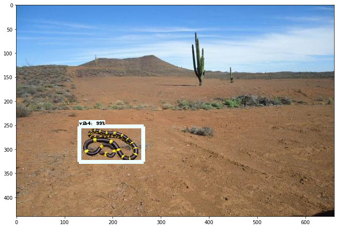
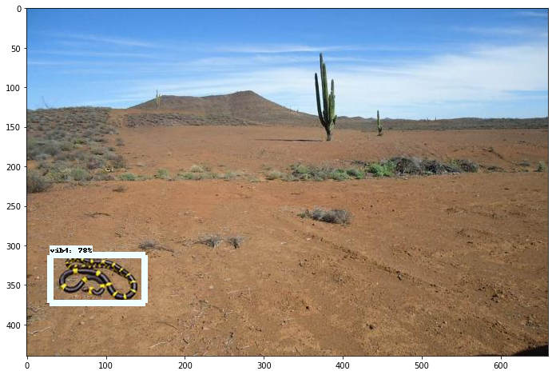
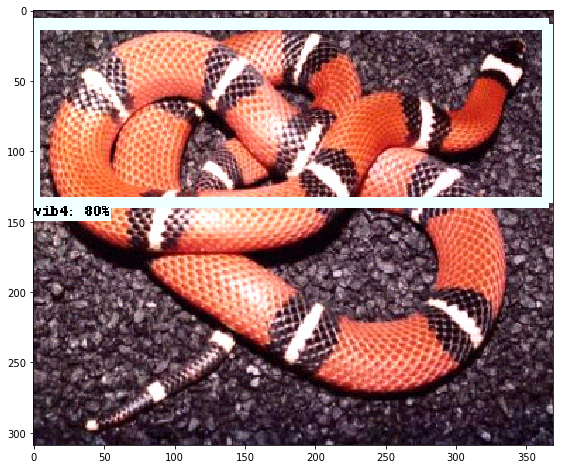
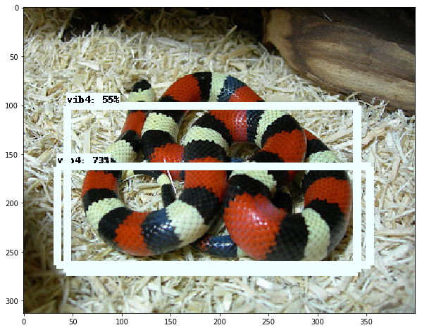

## Object Detection api

Para este proyecto estamos usando una api basada en tensorflow para la deteccion de objetos en [object-detection-api](https://github.com/tensorflow/models/tree/master/research/object_detection) el cual viene acompañado de unos tutoriales
de instalacion y uso.

### Tutorial

Siguiendo los pasos de instalación con una variación al instalarlo en windows podemos llegar a obtener los siguientes
resultados: 


Aqui vamos a incluir los pasos que yo hice para instalarlo en windows con maquina virtual de linux.......(Proximamente)

### Red convolucional
Estas son redes que generalmente se usan para procesar imagenes y estan basada en operaciones de convolucion.  
las redes se componen de tres tipos de capas:
1. capas de convolucion :  Consisten en filtrar una imagen usando máscaras aprendidas por la misma red
2. Una capa de pooling o de reducción: la cual va a reducir la cantidad de parámetros al quedarse con las características más comunes.
3. Capas totalmente conectadas, las cuales se encargan de hacer la clasificacion final.

#### R-CNN
lrkjeklrjf'lvjfd;ljgf;dlkvj


### Generando Imagenes

Dado el poco conociemiento para generar imagenes con calidad, lo que hice a continuacion fue descargar unas imagenes ".png" de mis
objetos a reconocer y unos paisajes ".jpg" en donde pondremos nuestros objetos.

Estas son una de las imagenes descargadas.

Objeto:


Entorno:


Segmento de codigo en el que generamos la imagen y el marcado ([Codigo Completo](https://github.com/alexis96/proyecto-CNN/blob/master/Codigos/fotosRedes.py))

```python
for i in range(1,5):
    habitat = "viboras/h" + str(i) + ".jpg"
    print(habitat)
    image = Image.open(habitat)#.convert("RGBA")
    
    for j in range(1,6):
        vibora = "viboras/vib" + str(j) + ".png"
        print(vibora)
        vib = Image.open(vibora).convert("RGBA")
        
        name.text = "vib" + str(j)
        
        for k in range(10):
            size = np.random.randint(70,130)
            r = size/float(vib.width)
            sizeheight = int(vib.height * r)
            #vib = vib.rotate(np.random.randint(180))
            vib = vib.resize((size,sizeheight),Image.ANTIALIAS)
            image_copy = image.copy()
            width.text = str(image_copy.width)
            height.text = str(image_copy.height)
            
            
            
            posw = np.random.randint((image_copy.width - vib.width))
            xmin.text = str(posw)
            xmax.text = str(posw + vib.width)
            
            posh = np.random.randint((image_copy.height - vib.height))
            ymin.text = str(posh)
            ymax.text = str(posh + vib.height)
            
            position = (posw, posh)
            image_copy.paste(vib, position,vib)
            
            new_name = "viboras_" + str(i) + "_" + str(j) +"_"+ str(k)+ ".jpg"
            filename.text = new_name
            path.text = c + new_name
            
            new_namexml = "viboras_" + str(i) + "_" + str(j) +"_"+ str(k)+ ".xml"
            
            image_copy.save(new_name)
            tree.write(new_namexml)

```

Archivo xml producido con codigo antes descrito con la informacion de la imagen y el marcaje del objeto:

```xml
<annotation>
    <folder>fotos redes</folder>
    <filename>viboras_2_5_3.jpg</filename>
    <path>C:\Users\alexi\Downloads\fotos redes\viboras_2_5_3.jpg</path>
    <source>
            <database>Viboras</database>
    </source>
    <size>
            <width>660</width>
            <height>440</height>
            <depth>3</depth>
    </size>
    <segmented>0</segmented>
    <object>
            <name>vib5</name>
            <pose>Unspecified</pose>
            <truncated>0</truncated>
            <difficult>0</difficult>
            <bndbox>
                    <xmin>57</xmin>
                    <ymin>225</ymin>
                    <xmax>137</xmax>
                    <ymax>282</ymax>
            </bndbox>

    </object>
</annotation>

            
```
Y estos son algunos de los resultados obtenidos al correr el codigo...no muy buenos pero creo que pueden funcionar:


separamos los datos generados en dos partes uno para el entrenamiento y otro para las pruebas, en una proporcion
90% entrenamiento, 10% pruebas aproximadamente.


una vez generado el marcaje y separado los datos hay que generar los archivos TFRecords 
para esto primero debemos convertir nuestros XML a un archivo CSV para despues este poderlo
convertir en un TFRecords para este usamos algunos codigos de [datitran-github](https://github.com/datitran/raccoon_dataset) haciendole
unas pequeñas modificaciones para nuestro caso.

Usamos primero [xml_to_csv.py](https://github.com/alexis96/proyecto-CNN/blob/master/Codigos/xml_to_csv.py)tratando de obtener una estructura como la siguiente:

```xml
Object-Detection
-data/
--test_labels.csv
--train_labels.csv
-images/
--test/
---testingimages.jpg
--train/
---testingimages.jpg
--...yourimages.jpg
-training
-xml_to_csv.py

```


y una vez construido nuestros archivos vamos a usar otro codigo llamado [generate_tfrecord.py](https://github.com/alexis96/proyecto-CNN/blob/master/Codigos/generate_tfrecord.py)
en el que solo vamos a modificar el numero y nombre de nuestras clases en mi caso 5.

```python
#Remplazar por el nombre de sus clases y añadir en caso de tener mas
def class_text_to_int(row_label):
    if row_label == 'clase1':
        return 1
    if row_label == 'clase2':
        return 2
    if row_label == 'clase3':
        return 
    if row_label == 'clase4':
        return 4
    if row_label == 'clase5':
        return 5
    else:
        None
```
ahora suponiendo que ya tenemos la instalacion de la object-detection api
 vamos a correr nuestro script generate_tfrecord.py

python generate_tfrecord.py 
  --csv_input=data/train_labels.csv 
  --output_path=data/train.record

python generate_tfrecord.py 
  --csv_input=data/test_labels.csv 
  --output_path=data/test.record
  
una ves hecho esto ya tenemos creado nuestros records para la prueba y el 
entrenamiento.
 
 
### Pasos para hacer el entrenamiento

Para iniciar el entrenamiento y hacer esto un poco mas rapido vamos a tomar un
modelo pre-entrenado obtenido con el siguiente comando:

-wget http://download.tensorflow.org/models/object_detection/ssd_mobilenet_v1_coco_11_06_2017.tar.gz

una vez teniendo este en nuestra carpeta vamos a copiar el archivo para hacer configuracion del modelo 
para nuestro que se encuentra en la carpeta de object_detection/samples/configs/ssd_mobilenet_v1_pets.config
en el que vamos a modificar algunas cosas comentadas [aqui](https://github.com/alexis96/proyecto-CNN/blob/master/Codigos/ssd_mobilenet_v1_pets.config)

ahora en nuestra carpeta training vamos a poner la configuracion modificada y vamos a crear el
object-detection.pbtxt con el siguiente contenido dependiendo del num de clases del proyecto:
```xml
item {
  id: 1
  name: 'vib1'
}
item {
  id: 2
  name: 'vib2'
}
.
.
.

```
ya con esto estamos listos para entrenar copiamos las carpetas data, images y training en la carpeta
object-detection de la api 

y corremos el siguiente comando y listo

#from models/research/object-detection
python train.py --logtosderr --train_dir=training/ --pipeline_config_path=training/ssd_mobilenet_v1_pets.config

y despues este para checar el procedimiento

tensorboard --logdir=training/


### Resultados rapidos para mostrar










